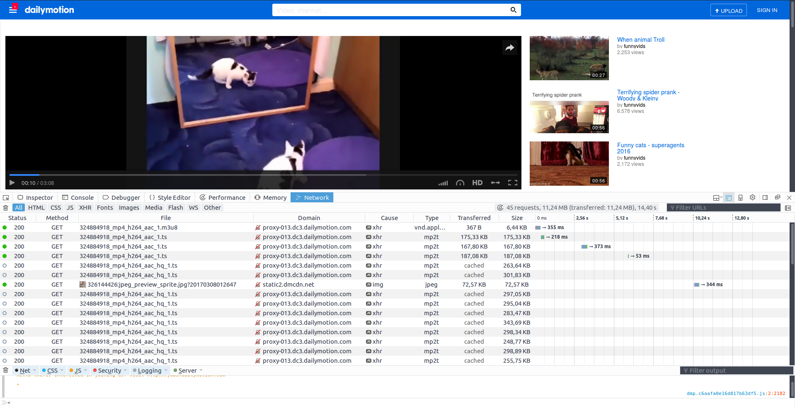
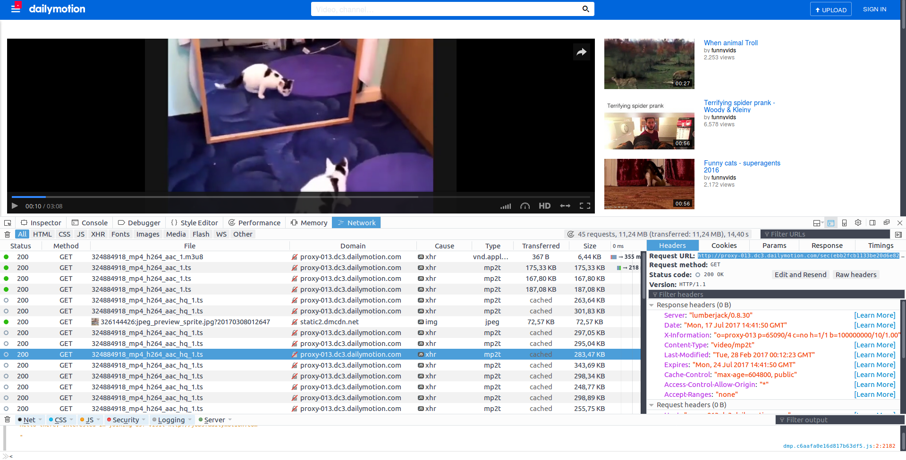

# Download streaming content

Sometimes, having access to content only as streaming is frustrating. For example, you may want to look at a video usually accessible through streaming at a later point in time when you know you will not have access to the internet. In this case, you may want to download the content usually available as streaming and save it for personal later use.

This repository contains a couple of simple Python scripts to help you do exactly that. The code will help you automatically download, and assemble, .ts files used for transmitting streaming information to your computers by many websites. The code works great on Ubuntu 16.04.

## Repository organisation

- Licence this readme and a couple of pictures to illustrate the readme are at the root. 
- The **StreamingDownloader/** folder contains code for performing the download, and an example (*test_downloader.py*), which corresponds to the example of the 'How to use' section.

## How to get the code

Clone the repository in a folder on your computer.

```[bash]
git clone ??
```

## Requirements

The code works great on Ubuntu 16.04, and probably many other Linux versions. You will need a couple of well-known programs / Python modules for it to work:

- ffmpeg
- mplayer
- Python requests

You can install all of them by [note: I assume that you use python pip. I recommend that you also use a virtualenv. If you do not know about those, google 'python pip' and 'python virtualenv']:

```[bash]
sudo apt-get install ffmpeg
sudo apt-get install mplayer
pip install requests
```

## How to use the code

The code is not 'tuned' against a specific website. This means that it can be used on a pretty large array of websites, but also that you will have to do a bit of work by hand to start it. Here is an example of how you can download a video of cats from Dailymotion (the method would be applicable to many other sites), available at: http://www.dailymotion.com/video/x5dfet2 . This example is the same as performed by **StreamingDownloader/test_downloader.py**.

- Get to the page where the video you want to download is hosted using a web browser. I will use firefox.
- Once you are on the page, open the Network Monitor. With Firefox, this is done by the keys shortcut [Ctrl] + [Shift] + [q].
- Launch the video. You will see plenty of GET requests by your browser to the server, see Fig. 1. Select one of the requests that contains the video content. Often those requests are those which correspond to files of relatively big size, and are of type mp2t. Click on one of those requests. This will open a new tab about this specific request with more detailed information. Copy the URL (see Fig. 2). For example, I get http://proxy-013.dc3.dailymotion.com/sec(ebb2fcb1133be20d6e82e3905cbc8d89)/frag(9)/video/819/488/324884918_mp4_h264_aac_hq_1.ts . You can see that this is a .ts file, which contains video data.
- Identify the part of the name that describes the fragment index. For example, here, the 'frag(9)' part of the url obviously indicates that this is the 9th segment. You could also copy paste a couple of urls and compare them to find out which part of the url describes the fragment number.
- Replace the fragment number by {}, so that the Python code will be able to perform the substitutions. For example, you should now have an url that looks like: http://proxy-013.dc3.dailymotion.com/sec(ebb2fcb1133be20d6e82e3905cbc8d89)/frag({})/video/819/488/324884918_mp4_h264_aac_hq_1.ts .
- Use this url in **test_downloader.py** or similar script. You can add subtitles using the same method if you want (usually, they are downloaded as a single .vtt files). Set up the *save_path*. Set up addiitonal options if you want.
- Open a console, and execute ```python test_downloader.py```. Soon you will have the video in the path you added.

Note: two download modes are offered: *immediate*, where all fragments are downloaded at once, and *streaming*. In *streaming* mode, the code will download segments so that it has always 120s of video buffered ahead of the current video time, where video time is time since download started. This means that the download will take about the true lenght of the video, but that your download pattern will look more like streaming, and less like downloading.


Fig. 1: requests issued when the streaming is started


Fig. 2: getting the URL of the streaming requests

## Warning!!

Some websites may forbid you from saving the content they give access to through streaming and bind you legally to follow their Terms of Use. Do not use this code to break agains the law. You use this code under your own responsability, I will not be held responsible for bad use of this code. I guess (but I am not a lawyer) that as long as you only save streaming content that you have legitimate right to access and use the saved file for personal use only, without distributing it, and destroy it when you have watched it, you should be fairly safe. But this may depend on where you live and other factors. Be aware that content you download may include, for example, watermarking / DRM that may identify you as the downloading source if the content was further distributed.

## Notes

If you want a fully automated tool for downloading streaming content, consider looking at *youtube-dl*: https://github.com/rg3/youtube-dl . There are a few differences between my code and this:

- You will not need to identify 'by hand' the urls if you use youtube-dl, the code will do it for you. The good part is, it will be easier for you / to integrate in scripts etc. The bad part is, you get less understanding of what is happening under the hood.
- You will not need any sudo command to use my code, only to install ffmpeg and mplayer which are well known packages. Reassuring if you are a bit careful with security ;)
- My code is much simpler (a bit simplistic?), but as a consequence it will probably be easier to adapt to about any website. By contrast, I think it may be a bit tricky to use youtube-dl on a website that is not supported (this is not a very good excuse, many sites are supported by youtube-dl, see https://rg3.github.io/youtube-dl/supportedsites.html , and it looks like the devs are very helpful and willing to add support for new ones).

